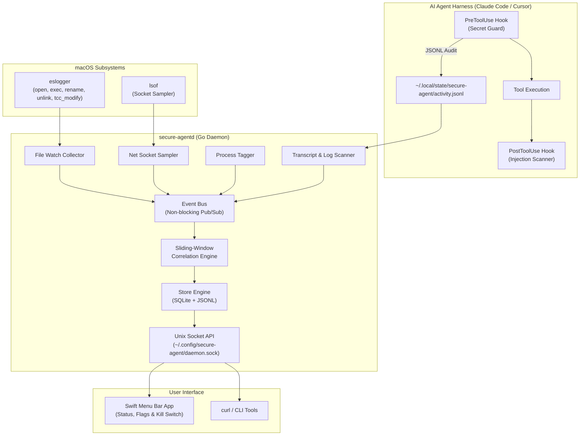

# secure-agent

[](https://github.com/cavi-ai/secure-agent/actions/workflows/ci.yml)
[](https://go.dev/)
[](https://swift.org/)
[](https://apple.com/macos)
[](LICENSE)

> **Egress inspection & secret-leak firewall for local AI agents.** See what your agents send, catch secrets before they leak, and stop rotating your keys three times a week.

<p align="center">
  
</p>

**`secure-agent`** is a lightweight, always-on AI-agent security monitor and harness guard designed for macOS.

> **Platform support.** macOS 14+ is the primary target (Endpoint Security telemetry, menubar app, DMG packaging). The Go daemon also builds and runs on **Linux** (`GOOS=linux go build ./...`), where Endpoint Security (`eslogger`) file telemetry degrades gracefully to the transcript scanner and network sampling runs on `/proc` — the guard hooks, egress firewall, fleet, and console all work identically. CI enforces the Linux build + tests on every push.

As AI coding agents (Claude Code, Cursor, Codex, Gemini, opencode, Copilot, etc.) gain increasing autonomy in local development environments, they gain execution privileges to read local sensitive files, mutate shell configurations, access credential stores, and initiate external network connections. `secure-agent` provides a non-intrusive, multi-layered defense system that enforces zero-trust boundaries around AI agent process trees without disrupting developer velocity.

---

## 🌟 Key Features

- 🛡️ **In-Harness Secret Guard (`PreToolUse` Gating)**  
  Synchronously intercepts agent tool calls to block unauthorized reads or mutations targeting Keychain files (`login.keychain-db`), shell configurations (`.zshrc`, `.zshenv`, `/etc/paths`), SSH keys, and cloud credentials. Supports Claude Code and Cursor hook protocols.

- 💉 **Prompt Injection Detection (`PostToolUse` Scanning)**  
  Scans tool output streams, web fetches, and agent transcripts in real time for indirect prompt injection vectors and credential leakage.

- ⚡ **Low-Overhead System Telemetry Daemon (`secure-agentd`)**  
  A pure Go daemon that consumes macOS Endpoint Security events (`eslogger`) and periodically samples per-process active network sockets (`lsof`). Current measured footprint: ~100 MB RSS resident, <2% CPU (the "<30 MB" target was written before the resource tracker, proxy, and advisor subsystems landed).

- 🧭 **Harness Trace Coverage**  
  Parses agent-semantic trace events (tool calls, model calls, turns) from Claude Code, Codex, Cursor, Antigravity (agy), and opencode transcripts — a metadata-only trace (names, durations, models, tokens; never content). opencode stores its trace in SQLite and is read by a read-only, watermarked poller. Coverage table in `docs/ARCHITECTURE.md`.

- 🔗 **Sliding-Window Event Correlation Engine**  
  Correlates process file activity with network egress. Automatically raises security flags when an agent process reads a sensitive file (e.g. `~/.aws/credentials` or `.env`) followed by an outbound socket connection to a domain outside its pre-approved vendor allowlist.

- 🚨 **Rotation Advisory & Incident Containment (Read-Only)**  
  Analyzes compromised secret exposures, categorizes risk severity (`CRITICAL`, `HIGH`, `MEDIUM`, `LOW`), assesses blast radius, and generates ordered step-by-step remediation checklists with copy-paste shell commands via `/incidents` and a native Swift UI remediation modal — advisory only, no rotation is performed automatically.

- 🌐 **Opt-In Local MITM Proxy & Payload Inspection (`127.0.0.1:8443`)**  
  Features an inline HTTP/HTTPS proxy server with dynamic TLS certificate generation (`CAManager`) that inspects request streams for outbound credential leaks (`redact.Detect`) and response streams for prompt injection attacks (`injection.Detect`).

- 🖥️ **Live Web Security Console (`http://localhost:8443/dashboard/`)**  
  Embedded dark-mode visual web console for real-time monitoring of active AI agent process trees, secret-exposure incident reports, sliding-window security flags, and proxy payload inspection streams. Its **Attention** view groups resource approvals, blocked guard requests, critical findings and incidents, and uninspected egress by complete session, with workspace, memory, CPU, process count, and scoped actions in one queue. Updates are pushed over SSE (`/events/stream`) with a polling fallback. The console's telemetry endpoints on the proxy port are gated by a per-install **console token** (0600, `~/.config/secure-agent/console-token`) — a credential agents never receive, so a routed agent can't turn its proxy token into telemetry reads or guard self-approval. The menubar's **Open console** passes the token automatically.

- 📊 **Resource Mission Control**
  Attributes live resident memory and CPU to complete agent sessions—root process plus helpers—so one runaway child cannot hide behind a harmless-looking parent. Whole-machine context shows available and free memory, compression, swap, CPU split between agents and everything else, memory pressure, thermal state, and a conservative headroom score. The console ranks sessions by pressure, charts one hour of history, explains heavy memory, full-core CPU, rapid growth, idle retention, runaway children, and orphan drift, and opens the entire process family before any terminate action. The native menu bar shows machine headroom and family totals and adds an **Impact** sort for quick daily triage. A bounded local flight recorder keeps pressure episodes, their captured host conditions, process attribution, and the ten-minute lead-up available for post-mortem review after a session exits. Each episode correlates redacted process, tool, file, network, guard, and security activity with the steepest observed memory rise while clearly distinguishing temporal correlation from proven causation.

  Optional session budgets add a sustained-breach grace period, cooldown, and
  a graduated `notify → lower priority → pause → terminate` ladder. `observe`
  reports only, `prompt` notifies automatically and requires approval for
  state-changing steps, and `terminate` executes the configured ladder
  automatically. Paused session families can be resumed from the console. The
  default is `observe` with both limits disabled.

- 🛠️ **Native `secure-agent` CLI Tool**  
  Pure-Go terminal utility (`secure-agent status`, `flags`, `incidents`, `kill`, `fleet`, `service`) for inspecting security posture directly from terminal prompts. `secure-agent service install` runs the daemon headless under launchd for fleet/CI nodes with no GUI login.

- 🔌 **Local Control & Query API**  
  Exposes a secure HTTP API over a Unix domain socket (`~/.config/secure-agent/daemon.sock`) for querying status, events, flags, incidents, and initiating process termination.

- ⚙️ **Extensible YAML Rules & Allowlists**  
  Easily customize sensitive path patterns, agent binary matchers, vendor network allowlists (`anthropic.com`, `cursor.sh`, `openai.com`), and proxy settings.

- 🔔 **Noise-Controlled Alerts, With Real Recourse**  
  Only **severity-3 criticals page you** by default (secret leaks, read-then-connect, TCC tampering, keychain CLI execs); warnings queue silently in the popover and console. Routine keychain-DB file opens are informational (severity 1) — legitimate tooling touches them constantly, so they never page unless you opt in. Every noisy class has a working **"Dismiss this flag class"** (rule-level mute, reversible from Settings → Muted flag classes), and Settings → Notifications / the console bell menu offer per-rule **Default / Always / Never** overrides (`/notify/rules`) shared by both UIs.

---

## 🏗️ System Architecture



---

## 🚀 Quick Start

### DMG Installation (recommended)

```bash
# Generate the app icon (one-time, or after changing artwork)
make icon

# Build universal binaries, assemble & sign "Secure Agent.app", package a DMG
make dmg
```

Open `dist/SecureAgent-<version>.dmg`, drag **Secure Agent.app** to **Applications**, and launch it.
The first-run setup wizard walks you through:

1. **Background monitor** — the `secure-agentd` daemon runs automatically as a child process of the app. It starts when you launch Secure Agent and stops when you quit it; there is no LaunchAgent and nothing runs in the background afterwards.
2. **Full Disk Access** — deep-links to System Settings → Privacy & Security → Full Disk Access.
3. **Harness hooks** — copies `secret_guard.py`, `injection_scan.py`, `activity_log.py` into `~/.claude/hooks`, `~/.cursor/hooks`, and `~/.config/opencode/hooks`.
4. **Extras** — Open at Login (`SMAppService`) and the `secure-agent` CLI symlink in `~/.local/bin`.

Everything is also manageable later from the menu bar icon (**Setup & Permissions…**, **Settings…**, **Uninstall…**, **Open Security Console**).

### In-app updates

The menu bar's **Settings… → Updates** tab offers two channels:

- **Stable** — the latest GitHub release. The app downloads the DMG, verifies
  it against the release's SHA-256 `checksums.txt` **before mounting** (a
  mismatch or a missing checksum is a loud refusal, never a silent install),
  replaces the app bundle in place, and relaunches (the daemon, a child of
  the app, comes down and back up with it).
- **Nightly** — builds from the current `origin/main` of a local checkout via
  `packaging/update_nightly.sh` (fetch → ff-only merge → `make install`).
  Developer-grade: it needs a git checkout and the repo toolchain; stable
  needs neither. The check refuses to move a tree with local-only commits.

#### Signing & notarization

`make dmg` ad-hoc signs by default (fine for local use; recipients must right-click → Open).
For proper Gatekeeper distribution:

```bash
export CODESIGN_IDENTITY="Developer ID Application: Your Name (TEAMID)"
xcrun notarytool store-credentials secure-agent-notary --apple-id you@example.com --team-id TEAMID
export NOTARY_PROFILE=secure-agent-notary
make dmg   # signs, notarizes, and staples both the app and the DMG
```

### Developer Installation (from source)

Prerequisites: macOS 14+, Go 1.22+, Swift 6.0 / Xcode CLT, Python 3.10+.

```bash
git clone https://github.com/cavi-ai/secure-agent.git
cd secure-agent
make build      # daemon, menubar, CLI into bin/
make test       # full Go + Swift + Python + E2E suites
make install    # build "Secure Agent.app" and launch it (no LaunchAgents)
```

> **Note**: To enable full Endpoint Security telemetry via `eslogger`, grant Full Disk Access to the helper binary `com.cavi-ai.secure-agent-esd` under **System Settings → Privacy & Security → Full Disk Access**. It appears in the list after the first denied attempt; the Settings card in the app deep-links to the pane.

### Plugin Hook Installation

To link the Python hook scripts into Claude Code and Cursor harness directories manually:

```bash
./plugin/install.sh
```

This creates symbolic links from `plugin/hooks/` to:
- `~/.claude/hooks/`
- `~/.cursor/hooks/`

---

## 🛡️ Egress Secret-Leak Firewall

Inspects what your agents send to their APIs and catches secrets leaving where they shouldn't — the class of mistake that forces constant key rotation.

<p align="center">
  
</p>

**Detection layers** (`daemon/internal/firewall/`):
- **Known-secret fingerprints** — your real secrets, stored only as a salted HMAC (never plaintext), matched even through base64 / url / gzip / JSON encodings.
- **Typed patterns** — Anthropic, OpenAI (incl. project keys), GitHub (classic + fine-grained), GitLab, AWS, Google, Stripe (secret/restricted/webhook), Slack, Twilio, SendGrid, npm, PyPI, DigitalOcean, Doppler, JWT, bearer tokens, private keys, and database connection strings with embedded credentials.
- **Entropy** — a high-entropy backstop (monitor-only).

**Precision, not noise.** A credential in the expected auth header to its own vendor host is *legitimate*, not a leak. A secret is flagged only when it goes to a non-vendor host, or lands in a request body / query / non-auth header. This is what makes blocking safe.

**Monitor by default; earn enforcement.** Every rule runs in `monitor` mode: leaks are reported, nothing is blocked. Promote a rule to blocking once you trust it, in `~/.config/secure-agent/config.yaml`:

```yaml
firewall:
  mode: monitor              # global default
  patterns:
    - { id: aws-key, type: cloud-key, re: 'AKIA[0-9A-Z]{16}', mode: block }  # this rule now blocks
```

**Route agents through the proxy** (opt-in, scoped to your shell — no keychain or system-trust changes). The daemon writes a snippet to `~/.config/secure-agent/agent-env.sh`; source it where you launch agents (or use the menu bar **Setup → Agent Routing**):

```bash
source ~/.config/secure-agent/agent-env.sh
```

The snippet carries a per-install proxy token, so the loopback listener is not a free open proxy for other local processes — only routed agents can use it.

Traffic that bypasses the proxy (pinned or unrouted) is counted as `uninspected_egress` in the status — a **rolling 24h** distinct-endpoint count, so the number reflects the current blind spot instead of growing forever. Clicking the warning (console or posture banner) opens the drill-down: every endpoint with per-agent counts, last-seen, the advisor's verdict, and a one-click **Allow** that closes the blind spot (`GET /egress/uninspected` for the raw list).

See [docs/FIREWALL_THREAT_MODEL.md](docs/FIREWALL_THREAT_MODEL.md) for exactly what the firewall defends against, what it does not, and how it handles secret material.

---

## 🔒 Directory Guard

The second pillar: interactive allow/deny for sensitive file access — Little Snitch for agents, instead of for your network.

When an agent tool call touches a guarded path (SSH keys, cloud credentials, the keychain, `.env` files, shell rc files), the hook checks the rule's mode:

| Mode | Behavior |
|---|---|
| `monitor` (default) | Logged only. Nothing is blocked, nothing is asked. |
| `prompt` | The hook holds the tool call while the menu bar raises a native **Allow Once / Allow Always / Deny** prompt. Your answer is remembered per `(agent, rule)` — "Allow Always" is cached, so the same agent hitting the same rule again is resolved instantly with no further prompt. |
| `deny` | Blocked outright, no prompt. |

**Quiet by default.** Every rule ships `monitor` — nothing is blocked out of the box. The onboarding **"Guard My Secrets"** step is the explicit opt-in that promotes SSH keys, cloud credentials, and the keychain to `prompt`, written to `~/.config/secure-agent/guard-modes.json`.

**Honest coverage.** The `PreToolUse` hook enforces at the tool-call boundary — it can actually block a `prompt`/`deny` rule before the tool runs. The daemon's `eslogger` telemetry observes a broader slice of file activity (including access outside the hook's reach) but is observe-only there: it can log and correlate, not block.

| Surface | Coverage |
|---|---|
| Claude file tools (`Read`/`Write`/`Edit`/`NotebookEdit`) | Mode-enforced: `monitor` / `prompt` / `deny`, per rule. Writes to harness settings & hook scripts (`~/.claude/`, `~/.cursor/`, `~/.config/opencode/`) are always denied — that's the guard's own enforcement plane. |
| Claude `Grep`/`Glob` | Mode-enforced when the search root is a protected directory (`~/.ssh`, `~/.aws`, `~/.config/gcloud`, `~/.azure`, `~/.kube`, `~/.docker`, `~/.gnupg`, `~/Library/Keychains`) — a scan reaches every protected file inside, so the governing rule's mode gates the scan. Broad roots (e.g. `~`) stay ungated; file-level matches inside results are still enforced per call. |
| Claude `Bash` | `deny`-mode rules enforced (protected-directory targets like `cp -r ~/.ssh` included); key material (SSH keys, cloud credential files) always denied via `cat` **or any reader alias** (`grep`/`rg` included — `grep '' credentials` is the same leak). `prompt`-mode paths are also denied — there is no interactive prompt mid-Bash, so a `prompt` rule fails safe to `deny` there instead of asking. |
| Cursor | `Bash` commands only. Cursor's shell-exec payload doesn't carry a `tool_name`, which the file-tool guard needs to tell a `Write` from a `Read`. |

A sixth guard rule, `harness-config`, covers the harnesses' own settings and hook scripts. It ships `monitor` (reads logged); **Guard My Secrets** promotes it to `prompt` alongside SSH keys, cloud credentials, and the keychain. Writes are always denied regardless of mode — editing the hook or `settings.json` is how an agent removes the guard watching it.

Writes to `~/.claude/settings.json` and the hook scripts are now denied outright, so the obvious self-removal path is closed — but a determined agent can still probe paths outside the covered harness directories, and the harness's decision to invoke the hook at all can't be enforced from inside the hook. This layer raises the bar; it is not a complete seal.

See [docs/GUARD_THREAT_MODEL.md](docs/GUARD_THREAT_MODEL.md) for the full list of closed bypass classes, the known limits (symlinks, TOCTOU, static inline-code analysis), and exactly which failures fail closed vs. open.

---

## ⚙️ Configuration

`secure-agent` loads default configuration rules and applies user overlays from `~/.config/secure-agent/config.yaml`.

```yaml
# Sensitive file path patterns to monitor
sensitive_globs:
  - "**/.env"
  - "**/.env.*"
  - "~/.ssh/id_*"
  - "~/.aws/credentials"
  - "~/.config/gh/hosts.yml"

sensitive_paths:
  - "~/.aws"
  - "~/.ssh"

keychain_markers:
  - "library/keychains"
  - ".keychain-db"
  - "login.keychain"

# Agent binary matching rules
agents:
  - name: claude
    match: ["claude"]
  - name: cursor
    match: ["Cursor Helper", "cursor"]
  - name: codex
    match: ["codex"]

# Pre-approved egress domains per agent
vendor_allowlist:
  claude: ["anthropic.com", "claude.ai"]
  cursor: ["cursor.sh", "cursor.com"]
  codex: ["openai.com", "api.openai.com"]

# Network sampling frequency
net_sample_interval_ms: 2000

# Socket & storage locations
socket_path: "~/.config/secure-agent/daemon.sock"
db_path: "~/.local/state/secure-agent/events.db"
jsonl_path: "~/.local/state/secure-agent/events.jsonl"

# Opt-in local proxy configuration (MITM + web console hitchhike)
proxy_enabled: false
proxy_port: 8443
proxy_ca_cert_path: "~/.config/secure-agent/ca.crt"
proxy_ca_key_path: "~/.config/secure-agent/ca.key"

# Opt-in local advisor: a locally served model (MLX, llama.cpp, Ollama —
# any OpenAI-compatible chat endpoint) triages flags and writes incident
# narratives. Loopback-only, enforced in code; advisory verdicts can never
# change enforcement. See docs/ADVISOR_THREAT_MODEL.md.
advisor:
  enabled: false                     # flip to true once a local model is serving
  endpoint: "http://127.0.0.1:8080"  # must be loopback
  model: ""                          # e.g. "qwen3-4b-instruct"
  timeout_ms: 8000
```

### 🧠 Local advisor

With a local model serving the endpoint above, every flag gets an advisory
triage verdict (`advisor: benign / suspicious / malicious` chip on the flag
card, with the rationale as its tooltip), the posture banner and menubar hero
summarize how many critical flags look benign, and each incident card gains a
plain-English narrative. The advisor is async and fails silent: if the model
is down, nothing changes except the absence of verdicts.

---

## 🔌 Unix Socket Control API

The Go daemon listens on a local Unix domain socket (`~/.config/secure-agent/daemon.sock`).

### Endpoints

| Endpoint | Method | Description |
|---|---|---|
| `/status` | `GET` | Returns daemon running state, uptime, active agent count, and proxy status. |
| `/resources` | `GET` | Returns attributed session-family RSS, CPU, process topology, history, diagnoses, and reclaim estimates. |
| `/resources/control` | `POST` | Applies or dismisses a pending resource action, or resumes a paused session family. |
| `/flags` | `GET` | Returns recent security correlation flags (accepts optional `?limit=N`). |
| `/events` | `GET` | Returns recent raw system events (accepts optional `?limit=N`). |
| `/incidents` | `GET` | Returns rotation intel postmortem reports & checklists (`?id=ID`, `?format=markdown`). |
| `/kill` | `POST` | Terminate an agent process tree by PID (`{"pid": 12345}`). |

### Example Query

```bash
curl --unix-socket ~/.config/secure-agent/daemon.sock http://unix/status
```

```json
{
  "running": true,
  "uptime": "2h45m12s",
  "active_agents": 2
}
```

```bash
curl --unix-socket ~/.config/secure-agent/daemon.sock http://unix/flags?limit=10
```

---

## 🛰️ Connect a Fleet

The fleet contract is two sides: each node pushes signed webhooks, and a collector rolls them up.

**Node side** — one command enrolls this machine into a collector:

```bash
secure-agent fleet enroll https://collector.internal:9445
```

Enroll reads the node id from the running daemon, generates the shared secret, merges the webhook into `~/.config/secure-agent/config.yaml` (backup written first), and prints the single line to append to the collector's secrets file. The daemon hot-reloads fleet config — deliveries begin within seconds, **no daemon restart**. (Manual setup still works; the equivalent `config.yaml` block is below.)

```yaml
fleet:
  hostname: "builder-01"                      # display name (default: os.Hostname)
  labels: { env: prod, role: build-runner }   # grouping dimensions for fleet views
  heartbeat_interval_sec: 60                  # status cadence (default 60)
  webhooks:
    - url: "https://collector.internal:9445/hooks/secure-agent"
      secret: "<shared-secret>"
      events: [flag, incident, guard]   # empty = all
```

Every flag, incident, and guard decision is POSTed as an envelope:

```json
{"node_id": "…32-hex…", "kind": "flag", "ts": "…", "version": "v0.9.0-rc.1", "boot": "…", "seq": 42, "payload": {…}}
```

with `X-SecureAgent-Signature: sha256=<hex hmac-sha256(secret, body)>` and `X-SecureAgent-Node: <node_id>` headers. `boot` + `seq` are the node's gap-detection coordinates: every delivery is numbered per daemon run, so a dropped delivery (backlog cap, collector downtime, restart) surfaces at the collector as a **sequence gap** — best-effort delivery, but never *silent* loss.

Nodes also push a **`status` heartbeat** — at boot, on the interval, and immediately on posture-state changes — carrying the node's own `/posture` headline (`posture_state`, `posture_summary`, `needs_you`) plus hostname, labels, and agent count. The heartbeat bypasses the `events:` filter on purpose: liveness you can unsubscribe from is indistinguishable from a dead node. This is what lets the collector answer the two fleet questions that matter — *"is anything critical anywhere?"* and *"is every node alive?"*

**Collector side** — the reference collector in this repo (`cmd/secure-agent-collector`, stdlib-only):

```bash
make collector
# provision one secret per node, then run (loopback by default):
printf '%s
' "<node-id-1>=<secret-1>" > secrets.txt
./bin/secure-agent-collector -addr 127.0.0.1:9445 -store ~/.local/state/secure-agent-collector -config secrets.txt
```

- `GET /fleet` — merged multi-node rollup ordered by operator priority (critical → attention → stale → all-clear): version (tracks the newest report), liveness vs. last-activity timestamps, **rolling 24h counts** (`flags_24h`, `critical_flags_24h`, `incidents_24h`), guard allow/deny breakdown, sequence-gap count, and each node's posture headline
- `GET /fleet/rules` — **cross-node rule aggregation**: which flag rules are firing, on how many of the fleet's nodes ("`sensitive-read-then-connect` — 5/12 nodes, 3 critical in 24h"). One node is an incident; five is a bad release.
- `GET /nodes/<id>/events?kind=flag&limit=50` — one node's stored envelopes
- `GET /` — dark overview page: fleet headline (*"2 critical · 1 stale · 12 all-clear"*), the rules-across-fleet table, and per-node cards titled by hostname with posture chips, label chips, and delivery-gap warnings
- `GET /healthz` — liveness

Liveness is heartbeat-aware: nodes sending `status` are stale after 3 missed minutes and "gone quiet" after 10; legacy event-only nodes keep the lenient 10/20-minute thresholds.

Signatures are verified constant-time; unsigned, tampered, wrong-node, and unknown-node traffic is rejected. Deliveries retry (500ms/2s/5s) on network errors and 5xx/429 only; failures land in the node's `webhook-deliveries.jsonl`.

The whole chain — node → signed webhook → verified envelope (flag **and** heartbeat) with contiguous sequence numbers → posture-aware rollup — plus the `fleet enroll` CLI flow, is enforced by `packaging/test/e2e_smoke.sh` on every CI run.

---

## 🧪 Testing & Verification

The repository includes test suites across Go, Python, Swift, and end-to-end shell smoke testing.

```bash
# 1. Run Go daemon unit & integration tests
go test ./...

# 2. Run Python plugin hook test suites
python3 plugin/hooks/test_secret_guard.py
python3 plugin/hooks/test_injection_scan.py
python3 plugin/hooks/test_activity_log.py

# 3. Run Swift menu bar package tests
swift test --package-path menubar

# 4. Run console JS unit tests + DOM tests + asset lint
node --test 'packaging/test/console/*.test.mjs'
python3 packaging/test/console_dom/run_dom_tests.py
./packaging/test/check_console_css.sh

# 5. Run end-to-end smoke test script
./packaging/test/e2e_smoke.sh
```

---

## 📂 Repository Layout

```
secure-agent/
├── daemon/               # Go telemetry daemon (secure-agentd)
│   ├── cmd/              # Main executable entrypoint
│   └── internal/         # Collectors, bus, correlator, store, API, config
│   │       └── api/web_dist/  # Embedded web console assets (canonical source)
├── plugin/               # Harness plugin hooks (Claude Code / Cursor / opencode)
│   ├── hooks/            # secret_guard.py, injection_scan.py, activity_log.py
│   └── install.sh        # Symlink installer script (dev flow)
├── menubar/              # Native Swift menu bar app ("Secure Agent.app")
│   ├── Package.swift     # SwiftPM manifest
│   └── Sources/          # AppKit / SwiftUI NSStatusItem interface + setup wizard
├── packaging/            # Distribution & deployment
│   ├── make_app.sh       # Universal build → signed Secure Agent.app
│   ├── make_dmg.sh       # Notarize (optional) → distributable DMG
│   ├── make_icon.sh      # Generates AppIcon.icns
│   ├── install.sh        # Dev helper: build Secure Agent.app and launch it
│   ├── uninstall.sh      # Remove legacy LaunchAgents/binaries/hooks from older installs
│   └── test/             # E2E smoke testing harness
├── CONTRIBUTING.md       # Open-source contribution guidelines
└── SECURITY.md           # Security disclosure policy
```

---

## 🤝 Contributing

We welcome community contributions! Please read our [CONTRIBUTING.md](CONTRIBUTING.md) guide for details on development workflows, coding standards, and submitting pull requests.

---

## 📄 License

Distributed under the MIT License. See [LICENSE](LICENSE) for details.
