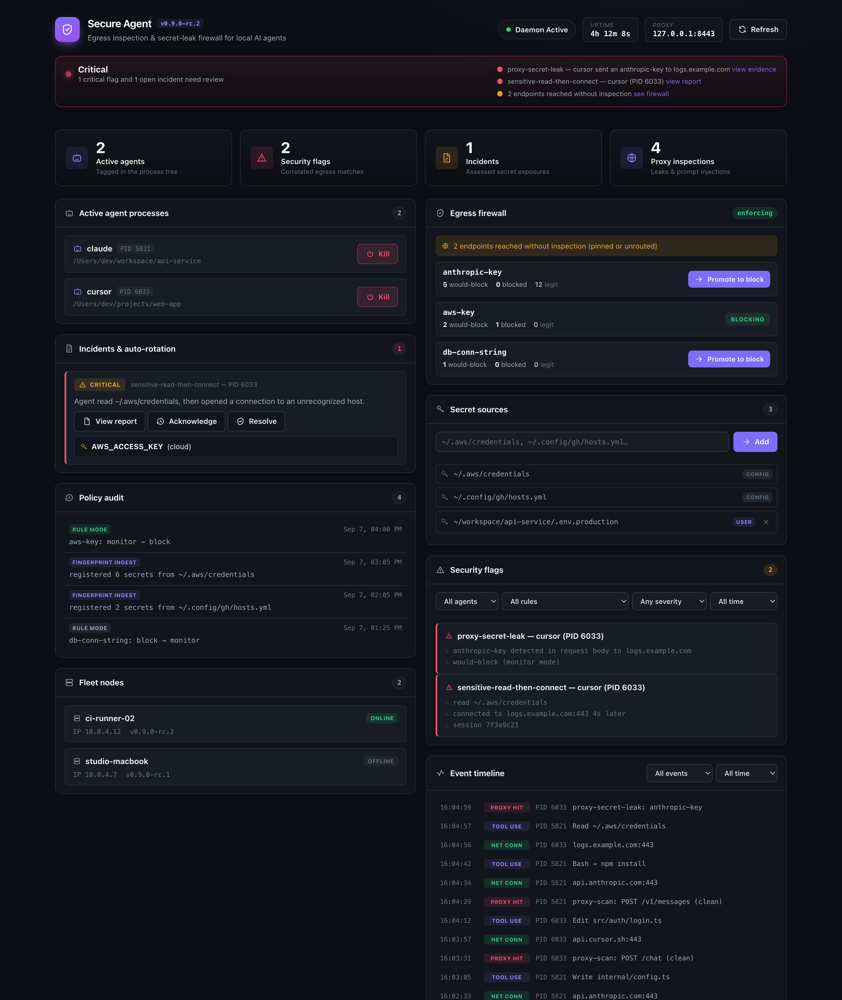
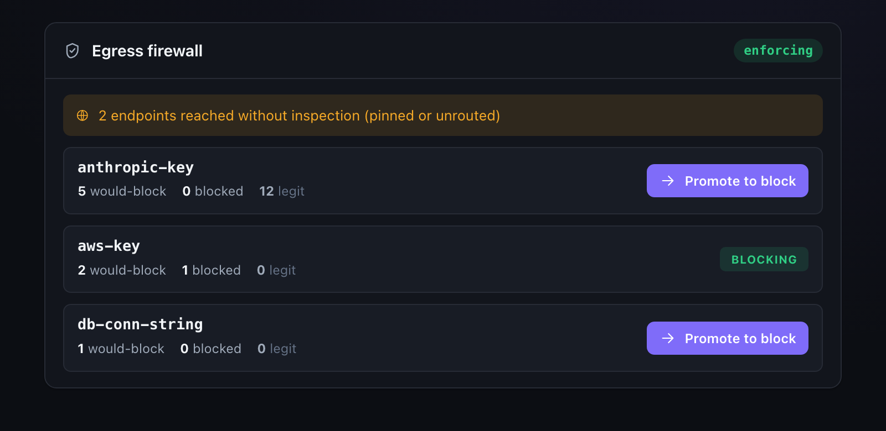

# secure-agent

[](https://go.dev/)
[](https://swift.org/)
[](https://apple.com/macos)
[](LICENSE)

> **Egress inspection & secret-leak firewall for local AI agents.** See what your agents send, catch secrets before they leak, and stop rotating your keys three times a week.

<p align="center">
  
</p>

**`secure-agent`** is a lightweight, always-on AI-agent security monitor and harness guard designed for macOS.

As AI coding agents (Claude Code, Cursor, Codex, OpenClaw, Copilot, etc.) gain increasing autonomy in local development environments, they gain execution privileges to read local sensitive files, mutate shell configurations, access credential stores, and initiate external network connections. `secure-agent` provides a non-intrusive, multi-layered defense system that enforces zero-trust boundaries around AI agent process trees without disrupting developer velocity.

---

## 🌟 Key Features

- 🛡️ **In-Harness Secret Guard (`PreToolUse` Gating)**  
  Synchronously intercepts agent tool calls to block unauthorized reads or mutations targeting Keychain files (`login.keychain-db`), shell configurations (`.zshrc`, `.zshenv`, `/etc/paths`), SSH keys, and cloud credentials. Supports Claude Code and Cursor hook protocols.

- 💉 **Prompt Injection Detection (`PostToolUse` Scanning)**  
  Scans tool output streams, web fetches, and agent transcripts in real time for indirect prompt injection vectors and credential leakage.

- ⚡ **Low-Overhead System Telemetry Daemon (`secure-agentd`)**  
  A pure Go daemon that consumes macOS Endpoint Security events (`eslogger`) and periodically samples per-process active network sockets (`libproc`). Maintains a lightweight footprint (<30 MB RAM, <2% CPU).

- 🔗 **Sliding-Window Event Correlation Engine**  
  Correlates process file activity with network egress. Automatically raises security flags when an agent process reads a sensitive file (e.g. `~/.aws/credentials` or `.env`) followed by an outbound socket connection to a domain outside its pre-approved vendor allowlist.

- 🚨 **Rotation Advisory & Incident Containment (Read-Only)**  
  Analyzes compromised secret exposures, categorizes risk severity (`CRITICAL`, `HIGH`, `MEDIUM`, `LOW`), assesses blast radius, and generates ordered step-by-step remediation checklists with copy-paste shell commands via `/incidents` and a native Swift UI remediation modal — advisory only, no rotation is performed automatically.

- 🌐 **Opt-In Local MITM Proxy & Payload Inspection (`127.0.0.1:8443`)**  
  Features an inline HTTP/HTTPS proxy server with dynamic TLS certificate generation (`CAManager`) that inspects request streams for outbound credential leaks (`redact.Detect`) and response streams for prompt injection attacks (`injection.Detect`).

- 🖥️ **Live Web Security Console (`http://localhost:8443/dashboard/`)**  
  Embedded dark-mode visual web console for real-time monitoring of active AI agent process trees, secret-exposure incident reports, sliding-window security flags, and proxy payload inspection streams.

- 🛠️ **Native `secure-agent` CLI Tool**  
  Pure-Go terminal utility (`secure-agent status`, `flags`, `incidents`, `kill`, `fleet`) for inspecting security posture directly from terminal prompts.

- 🔌 **Local Control & Query API**  
  Exposes a secure HTTP API over a Unix domain socket (`~/.config/secure-agent/daemon.sock`) for querying status, events, flags, incidents, and initiating process termination.

- ⚙️ **Extensible YAML Rules & Allowlists**  
  Easily customize sensitive path patterns, agent binary matchers, vendor network allowlists (`anthropic.com`, `cursor.sh`, `openai.com`), and proxy settings.

---

## 🏗️ System Architecture


---

## 🚀 Quick Start

### DMG Installation (recommended)

```bash
# Generate the app icon (one-time, or after changing artwork)
make icon

# Build universal binaries, assemble & sign "Secure Agent.app", package a DMG
make dmg
```

Open `dist/SecureAgent-<version>.dmg`, drag **Secure Agent.app** to **Applications**, and launch it.
The first-run setup wizard walks you through:

1. **Background monitor** — the `secure-agentd` daemon runs automatically as a child process of the app. It starts when you launch Secure Agent and stops when you quit it; there is no LaunchAgent and nothing runs in the background afterwards.
2. **Full Disk Access** — deep-links to System Settings → Privacy & Security → Full Disk Access.
3. **Harness hooks** — copies `secret_guard.py`, `injection_scan.py`, `activity_log.py` into `~/.claude/hooks`, `~/.cursor/hooks`, and `~/.config/opencode/hooks`.
4. **Extras** — Open at Login (`SMAppService`) and the `secure-agent` CLI symlink in `~/.local/bin`.

Everything is also manageable later from the menu bar icon (**Setup & Permissions…**, **Uninstall…**, **Open Security Console**).

#### Signing & notarization

`make dmg` ad-hoc signs by default (fine for local use; recipients must right-click → Open).
For proper Gatekeeper distribution:

```bash
export CODESIGN_IDENTITY="Developer ID Application: Your Name (TEAMID)"
xcrun notarytool store-credentials secure-agent-notary --apple-id you@example.com --team-id TEAMID
export NOTARY_PROFILE=secure-agent-notary
make dmg   # signs, notarizes, and staples both the app and the DMG
```

### Developer Installation (from source)

Prerequisites: macOS 14+, Go 1.22+, Swift 6.0 / Xcode CLT, Python 3.10+.

```bash
git clone https://github.com/cavi-ai/secure-agent.git
cd secure-agent
make build      # daemon, menubar, CLI into bin/
make test       # full Go + Swift + Python + E2E suites
make install    # build "Secure Agent.app" and launch it (no LaunchAgents)
```

> **Note**: To enable full Endpoint Security telemetry via `eslogger`, grant Full Disk Access to the daemon binary under **System Settings → Privacy & Security → Full Disk Access**.

### Plugin Hook Installation

To link the Python hook scripts into Claude Code and Cursor harness directories manually:

```bash
./plugin/install.sh
```

This creates symbolic links from `plugin/hooks/` to:
- `~/.claude/hooks/`
- `~/.cursor/hooks/`

---

## 🛡️ Egress Secret-Leak Firewall

Inspects what your agents send to their APIs and catches secrets leaving where they shouldn't — the class of mistake that forces constant key rotation.

<p align="center">
  
</p>

**Detection layers** (`daemon/internal/firewall/`):
- **Known-secret fingerprints** — your real secrets, stored only as a salted HMAC (never plaintext), matched even through base64 / url / gzip / JSON encodings.
- **Typed patterns** — Anthropic, OpenAI (incl. project keys), GitHub (classic + fine-grained), GitLab, AWS, Google, Stripe (secret/restricted/webhook), Slack, Twilio, SendGrid, npm, PyPI, DigitalOcean, Doppler, JWT, bearer tokens, private keys, and database connection strings with embedded credentials.
- **Entropy** — a high-entropy backstop (monitor-only).

**Precision, not noise.** A credential in the expected auth header to its own vendor host is *legitimate*, not a leak. A secret is flagged only when it goes to a non-vendor host, or lands in a request body / query / non-auth header. This is what makes blocking safe.

**Monitor by default; earn enforcement.** Every rule runs in `monitor` mode: leaks are reported, nothing is blocked. Promote a rule to blocking once you trust it, in `~/.config/secure-agent/config.yaml`:

```yaml
firewall:
  mode: monitor              # global default
  patterns:
    - { id: aws-key, type: cloud-key, re: 'AKIA[0-9A-Z]{16}', mode: block }  # this rule now blocks
```

**Route agents through the proxy** (opt-in, scoped to your shell — no keychain or system-trust changes). The daemon writes a snippet to `~/.config/secure-agent/agent-env.sh`; source it where you launch agents (or use the menu bar **Setup → Agent Routing**):

```bash
source ~/.config/secure-agent/agent-env.sh
```

Traffic that bypasses the proxy (pinned or unrouted) is counted as `uninspected_egress` in the status, so the blind spot is visible rather than silent.

See [docs/FIREWALL_THREAT_MODEL.md](docs/FIREWALL_THREAT_MODEL.md) for exactly what the firewall defends against, what it does not, and how it handles secret material.

---

## 🔒 Directory Guard

The second pillar: interactive allow/deny for sensitive file access — Little Snitch for agents, instead of for your network.

When an agent tool call touches a guarded path (SSH keys, cloud credentials, the keychain, `.env` files, shell rc files), the hook checks the rule's mode:

| Mode | Behavior |
|---|---|
| `monitor` (default) | Logged only. Nothing is blocked, nothing is asked. |
| `prompt` | The hook holds the tool call while the menu bar raises a native **Allow Once / Allow Always / Deny** prompt. Your answer is remembered per `(agent, rule)` — "Allow Always" is cached, so the same agent hitting the same rule again is resolved instantly with no further prompt. |
| `deny` | Blocked outright, no prompt. |

**Quiet by default.** Every rule ships `monitor` — nothing is blocked out of the box. The onboarding **"Guard My Secrets"** step is the explicit opt-in that promotes SSH keys, cloud credentials, and the keychain to `prompt`, written to `~/.config/secure-agent/guard-modes.json`.

**Honest coverage.** The `PreToolUse` hook enforces at the tool-call boundary — it can actually block a `prompt`/`deny` rule before the tool runs. The daemon's `eslogger` telemetry observes a broader slice of file activity (including access outside the hook's reach) but is observe-only there: it can log and correlate, not block.

---

## ⚙️ Configuration

`secure-agent` loads default configuration rules and applies user overlays from `~/.config/secure-agent/config.yaml`.

```yaml
# Sensitive file path patterns to monitor
sensitive_globs:
  - "**/.env"
  - "**/.env.*"
  - "~/.ssh/id_*"
  - "~/.aws/credentials"
  - "~/.config/gh/hosts.yml"

sensitive_paths:
  - "~/.aws"
  - "~/.ssh"

keychain_markers:
  - "library/keychains"
  - ".keychain-db"
  - "login.keychain"

# Agent binary matching rules
agents:
  - name: claude
    match: ["claude"]
  - name: cursor
    match: ["Cursor Helper", "cursor"]
  - name: codex
    match: ["codex"]

# Pre-approved egress domains per agent
vendor_allowlist:
  claude: ["anthropic.com", "claude.ai"]
  cursor: ["cursor.sh", "cursor.com"]
  codex: ["openai.com", "api.openai.com"]

# Network sampling frequency
net_sample_interval_ms: 2000

# Socket & storage locations
socket_path: "~/.config/secure-agent/daemon.sock"
db_path: "~/.local/state/secure-agent/events.db"
jsonl_path: "~/.local/state/secure-agent/events.jsonl"

# Opt-in local proxy configuration
proxy_enabled: true
proxy_port: 8443
proxy_ca_cert_path: "~/.config/secure-agent/ca.crt"
proxy_ca_key_path: "~/.config/secure-agent/ca.key"
```

---

## 🔌 Unix Socket Control API

The Go daemon listens on a local Unix domain socket (`~/.config/secure-agent/daemon.sock`).

### Endpoints

| Endpoint | Method | Description |
|---|---|---|
| `/status` | `GET` | Returns daemon running state, uptime, active agent count, and proxy status. |
| `/flags` | `GET` | Returns recent security correlation flags (accepts optional `?limit=N`). |
| `/events` | `GET` | Returns recent raw system events (accepts optional `?limit=N`). |
| `/incidents` | `GET` | Returns rotation intel postmortem reports & checklists (`?id=ID`, `?format=markdown`). |
| `/kill` | `POST` | Terminate an agent process tree by PID (`{"pid": 12345}`). |

### Example Query

```bash
curl --unix-socket ~/.config/secure-agent/daemon.sock http://unix/status
```

```json
{
  "running": true,
  "uptime": "2h45m12s",
  "active_agents": 2
}
```

```bash
curl --unix-socket ~/.config/secure-agent/daemon.sock http://unix/flags?limit=10
```

---

## 🧪 Testing & Verification

The repository includes test suites across Go, Python, Swift, and end-to-end shell smoke testing.

```bash
# 1. Run Go daemon unit & integration tests
go test ./...

# 2. Run Python plugin hook test suites
python3 plugin/hooks/test_secret_guard.py
python3 plugin/hooks/test_injection_scan.py
python3 plugin/hooks/test_activity_log.py

# 3. Run Swift menu bar package tests
swift test --package-path menubar

# 4. Run end-to-end smoke test script
./packaging/test/e2e_smoke.sh
```

---

## 📂 Repository Layout

```
secure-agent/
├── daemon/               # Go telemetry daemon (secure-agentd)
│   ├── cmd/              # Main executable entrypoint
│   └── internal/         # Collectors, bus, correlator, store, API, config
│   │       └── api/web_dist/  # Embedded web console assets (canonical source)
├── plugin/               # Harness plugin hooks (Claude Code / Cursor / opencode)
│   ├── hooks/            # secret_guard.py, injection_scan.py, activity_log.py
│   └── install.sh        # Symlink installer script (dev flow)
├── menubar/              # Native Swift menu bar app ("Secure Agent.app")
│   ├── Package.swift     # SwiftPM manifest
│   └── Sources/          # AppKit / SwiftUI NSStatusItem interface + setup wizard
├── packaging/            # Distribution & deployment
│   ├── make_app.sh       # Universal build → signed Secure Agent.app
│   ├── make_dmg.sh       # Notarize (optional) → distributable DMG
│   ├── make_icon.sh      # Generates AppIcon.icns
│   ├── install.sh        # Dev helper: build Secure Agent.app and launch it
│   ├── uninstall.sh      # Remove legacy LaunchAgents/binaries/hooks from older installs
│   └── test/             # E2E smoke testing harness
├── CONTRIBUTING.md       # Open-source contribution guidelines
└── SECURITY.md           # Security disclosure policy
```

---

## 🤝 Contributing

We welcome community contributions! Please read our [CONTRIBUTING.md](CONTRIBUTING.md) guide for details on development workflows, coding standards, and submitting pull requests.

---

## 📄 License

Distributed under the MIT License. See [LICENSE](LICENSE) for details.
